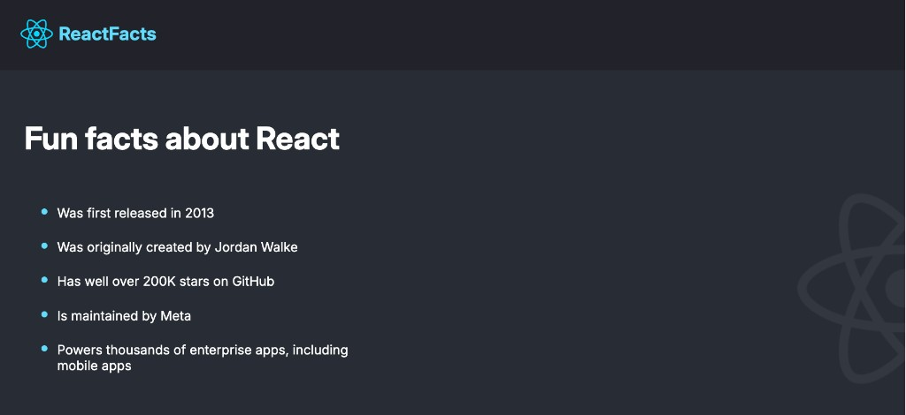

# ReactFacts

A small static single-page site built with React and Vite. It shows a branded navbar and a list of fun facts about React, styled with a dark theme and a decorative half React logo in the background.

This is my first React project, built while learning the fundamentals of components, JSX, and project structure.



## What it does

- Renders a `Navbar` with the React logo and the "ReactFacts" brand name
- Renders a `Main` section with a heading and a bulleted list of React facts
- Uses plain CSS (`src/index.css`) for layout, the Inter font, and the background logo

## Tech stack

- [React 19](https://react.dev)
- [Vite](https://vite.dev) with `@vitejs/plugin-react`
- ESLint (`eslint-plugin-react-hooks`, `eslint-plugin-react-refresh`)

## Project structure

```
.
├── index.html              # Vite entry HTML, loads Inter font
├── public/                 # Static assets (favicon, icons)
├── src/
│   ├── index.jsx           # Mounts <App /> into #root
│   ├── App.jsx             # Composes Navbar + Main
│   ├── index.css           # Global styles
│   ├── assets/             # Images (React logo, half logo background)
│   ├── Components/
│   │   ├── Navbar.jsx      # Header with logo and brand name
│   │   └── Main.jsx        # "Fun facts about React" list
│   └── Page/               # Earlier practice components (Header, MainContent, Footer, Page)
└── Quiz/                   # Notes and answers from React learning quizzes
```

## Getting started

Install dependencies:

```bash
npm install
```

Run the dev server:

```bash
npm run dev
```

Build for production:

```bash
npm run build
```

Preview the production build:

```bash
npm run preview
```

Lint the code:

```bash
npm run lint
```
